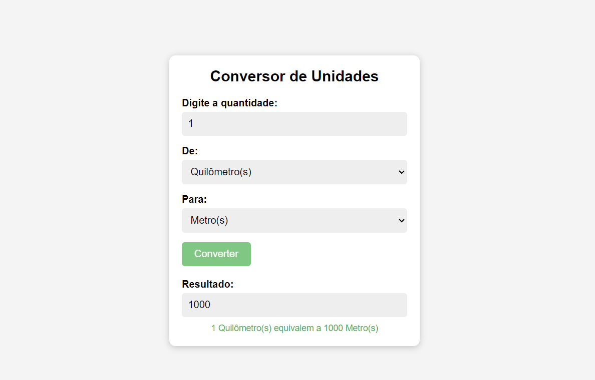

# Conversor de Unidades

## 📖 Introdução 

Este é um projeto de estudo prático em JavaScript, utilizando DOM para a criação de uma aplicação para conversão de números na mesma unidade de médida. As unidades disponiveis são: Metros, Quilometros, Centimetros e Milimetros.

## 🔗Link de Acesso
- Deploy: 

## 👥Equipe
| [<br><sub>Daniel Emidio</sub>](https://github.com/DanielEmidio1988) |
| :---: |

## 🧭Status do Projeto
- ⏳Concluído

## 📄Concepção do Projeto

### Layout

| <br><sub>Home Page</sub> | 
| :---: | 


### Funcionalidades
```bash
- Converter unidades de medida ao clicar no botão
```

## 💡Programas utilizados:
- VSCode

## 💻Tecnologias 


## 📫 Contato

E-mail: emidio.daniel@hotmail.com